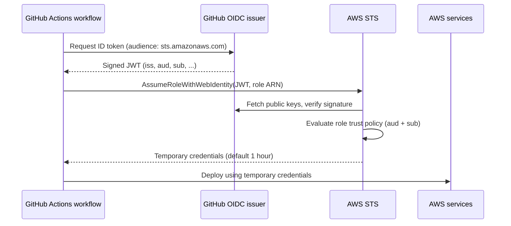

# GitHub Actions → AWS with OIDC (Immutable Subject Claims)

Keyless authentication from GitHub Actions to AWS using OpenID Connect (OIDC), provisioned with Terraform. This project uses GitHub's **immutable subject claim** format, which is the default for repositories created after **July 15, 2026**.

---

## Table of contents

1. [What this project does](#1-what-this-project-does)
2. [Why OIDC instead of access keys](#2-why-oidc-instead-of-access-keys)
3. [How the flow works](#3-how-the-flow-works)
4. [The subject claim and the July 15, 2026 change](#4-the-subject-claim-and-the-july-15-2026-change)
5. [Why the change was needed](#5-why-the-change-was-needed)
6. [Why it is secure](#6-why-it-is-secure)
7. [Project structure](#7-project-structure)
8. [File-by-file explanation](#8-file-by-file-explanation)
9. [Setup guide](#9-setup-guide)
10. [The GitHub workflow](#10-the-github-workflow)
11. [Troubleshooting](#11-troubleshooting)
12. [Security best practices](#12-security-best-practices)
13. [References](#13-references)

---

## 1. What this project does

Terraform creates three things in your AWS account:

| Resource | Purpose |
|---|---|
| **IAM OIDC provider** | Tells AWS to trust identity tokens issued by GitHub Actions |
| **IAM role** | The identity your workflow assumes to get AWS access |
| **Trust policy** | The rules that decide *which* repo and branch may assume the role |

A GitHub Actions workflow then exchanges a short-lived GitHub-signed token for temporary AWS credentials. **No AWS access keys are stored in GitHub.**

---

## 2. Why OIDC instead of access keys

| | Long-lived access keys | OIDC |
|---|---|---|
| Stored in GitHub secrets | Yes | No |
| Credential lifetime | Until rotated (often never) | Minutes to hours, auto-expiring |
| Leak impact | Valid until someone notices | Token is useless outside the trusted repo and branch |
| Rotation work | Manual | None |
| Scoping to repo/branch | Not possible | Built into the trust policy |

OIDC is the current industry standard for CI/CD-to-cloud authentication.

---

## 3. How the flow works



Step by step:

1. The workflow runs. Because it has `id-token: write`, GitHub allows it to request an OIDC token.
2. GitHub issues a **JWT signed with its private key**. The token contains claims describing the run: who issued it (`iss`), who it is for (`aud`), and which repo and branch it came from (`sub`).
3. `aws-actions/configure-aws-credentials` sends the token to AWS STS using `AssumeRoleWithWebIdentity`.
4. AWS looks up the OIDC provider, downloads GitHub's public keys, and **verifies the signature**.
5. AWS evaluates the role's **trust policy**. The `aud` and `sub` claims must match exactly.
6. If everything matches, STS returns temporary credentials. The action exports them as environment variables for later steps.

### Why it is called "web identity"

`AssumeRoleWithWebIdentity` is the STS call used when the caller proves identity with a **JWT from an external OIDC provider** rather than with AWS credentials. The name is historical (it was designed for web and mobile app logins), but it is the same API used for GitHub Actions, GitLab CI, and EKS service accounts. The caller needs no AWS credentials at all, because the token itself is the proof.

---

## 4. The subject claim and the July 15, 2026 change

The `sub` (subject) claim identifies **which workflow run** is asking for access. It is the main thing the trust policy checks.

### Old format (repositories created before July 15, 2026)

```
repo:OWNER/REPO:ref:refs/heads/BRANCH
repo:octo-org/octo-repo:ref:refs/heads/main
```

### New immutable format (repositories created after July 15, 2026)

```
repo:OWNER@OWNER-ID/REPO@REPO-ID:ref:refs/heads/BRANCH
repo:octo-org@123456/octo-repo@456789:ref:refs/heads/main
```

The numeric **owner ID** and **repository ID** are attached to the names with an `@` separator. `@` was chosen because it cannot appear in a GitHub username or repository name, so the IDs can never be confused with part of a name.

### Who gets which format

| Situation | Format |
|---|---|
| Repository created **after** July 15, 2026 | Immutable (automatic) |
| Repository **renamed or transferred** after July 15, 2026 | Immutable (automatic) |
| Repository created **before** July 15, 2026 | Previous format, unless you opt in |
| GitHub Enterprise Server | Not included in this rollout |

Existing repositories can opt in at the organization or repository level through the OIDC settings UI or the REST API. In a repository, check **Settings → Actions → OIDC** for the "Use immutable subject claim" option.

### Other `sub` patterns by trigger

The part after the repo changes depending on how the workflow was triggered. The repo portion shown here uses the new format.

| Trigger | `sub` suffix |
|---|---|
| Push or manual run on a branch | `:ref:refs/heads/main` |
| Pull request | `:pull_request` |
| Job with an environment | `:environment:production` |
| Tag | `:ref:refs/tags/v1.0` |

---

## 5. Why the change was needed

The OIDC specification requires a subject claim to be **locally unique and never reassigned**. The old format broke that rule, because it used only names, and names can be reused.

### The attack the old format allowed (namespace recycling)

1. You own `alice/deploy-tools` and your AWS role trusts `repo:alice/deploy-tools:ref:refs/heads/main`.
2. You delete the repo, rename it, or close your account. The name `alice/deploy-tools` becomes available.
3. An attacker registers the same username and creates a repo with the same name.
4. Their workflows now produce **exactly the same `sub` string** as yours.
5. Your AWS role, which still trusts that string, **accepts their tokens**.

The attacker never touched GitHub's signing keys or AWS. They only reused a name, and the trust policy could not tell the difference.

### The fix

Numeric IDs are assigned once and **never reused**. A recreated repo gets a new repository ID and a new owner ID, so its `sub` differs from the original, and the old trust policy rejects it.

---

## 6. Why it is secure

Security comes from several layers working together:

| Layer | What it protects against |
|---|---|
| **Signed JWT** | Forgery. AWS verifies the signature against GitHub's public keys. |
| **`aud` condition** | Token misuse. A token minted for another service is rejected. |
| **`sub` condition with `StringEquals`** | Wrong repo, wrong branch, forks, and other accounts. |
| **Immutable IDs in `sub`** | Namespace recycling and name-reuse takeover. |
| **Short-lived credentials** | Leaks. Credentials expire on their own (1 hour by default). |
| **Least-privilege policies** | Blast radius if a workflow is compromised. |
| **No stored secrets** | Credential theft from GitHub settings, logs, or forks. |

Key design choices in this project:

- `StringEquals` (exact match) is used for `sub`, not `StringLike` with wildcards.
- The trust policy is pinned to **one repo and one branch**.
- The role name, branch, and IDs all come from variables, so nothing is hand-edited in the policy.
- Session length is capped with `max_session_duration`.

---

## 7. Project structure

```
AWS-OIDC-Github/
├── .github/
│   └── workflows/
│       └── oidc-test.yml          # Workflow (must be at the repo root)
│
├── Terraform/
│   ├── versions.tf                # Terraform + AWS provider versions
│   ├── variables.tf               # All inputs
│   ├── oidc.tf                    # Provider, trust policy, role, permissions
│   ├── outputs.tf                 # Role ARN and allowed subject
│   └── terraform.tfvars.example   # Placeholder values
│   
├── README.md
└── .gitignore
```

> GitHub only reads workflows from `.github/workflows/` at the **repository root**. A workflow placed inside the `Terraform/` folder will not run.

---

## 8. File-by-file explanation

### `versions.tf`

Pins Terraform to `>= 1.5.0` and the AWS provider to `>= 5.81`. From that provider version, the OIDC provider's `thumbprint_list` is optional, because AWS validates GitHub's certificate against its own trusted CA library.

### `variables.tf`

| Variable | Description | Example placeholder |
|---|---|---|
| `aws_region` | Region for the provider | `ap-south-1` |
| `github_username` | Your GitHub user or org name, case-sensitive | `YOUR_GITHUB_USERNAME` |
| `github_repo` | Repository name only, case-sensitive | `YOUR_REPO_NAME` |
| `github_branch` | Branch allowed to assume the role | `main` |
| `github_owner_id` | Numeric owner ID | `YOUR_OWNER_ID` |
| `github_repo_id` | Numeric repository ID | `YOUR_REPO_ID` |
| `role_name` | IAM role name | `github-actions-deploy` |
| `create_oidc_provider` | `false` if the provider already exists in the account | `true` |
| `max_session_duration` | Credential lifetime in seconds (3600 to 43200) | `3600` |
| `policy_arns` | Managed policies to attach to the role | `[]` |

### `oidc.tf`

This is the core file. It has five parts.

**1. OIDC provider**

```hcl
resource "aws_iam_openid_connect_provider" "github" {
  count          = var.create_oidc_provider ? 1 : 0
  url            = "https://token.actions.githubusercontent.com"
  client_id_list = ["sts.amazonaws.com"]
}
```

Registers GitHub as a trusted identity source. `url` is the token issuer. `client_id_list` is the allowed audience. `count` makes it optional, because AWS allows only **one** provider per URL per account.

**2. Existing-provider lookup**

```hcl
data "aws_iam_openid_connect_provider" "github" {
  count = var.create_oidc_provider ? 0 : 1
  url   = "https://token.actions.githubusercontent.com"
}
```

The mirror image of part 1. When the provider already exists, Terraform reads it instead of failing on a duplicate.

**3. Locals: building the subject**

```hcl
locals {
  oidc_provider_arn = var.create_oidc_provider ? aws_iam_openid_connect_provider.github[0].arn : data.aws_iam_openid_connect_provider.github[0].arn

  use_ids = var.github_owner_id != "" && var.github_repo_id != ""

  github_sub = local.use_ids ? (
    "repo:${var.github_username}@${var.github_owner_id}/${var.github_repo}@${var.github_repo_id}:ref:refs/heads/${var.github_branch}"
  ) : (
    "repo:${var.github_username}/${var.github_repo}:ref:refs/heads/${var.github_branch}"
  )
}
```

- `oidc_provider_arn` picks the ARN from whichever of parts 1 or 2 is active.
- `use_ids` is `true` only if both IDs are provided.
- `github_sub` builds the **immutable format** when IDs are present and falls back to the **previous format** otherwise, so the same code works for repositories on either format.

**4. Trust policy**

```hcl
data "aws_iam_policy_document" "trust" {
  statement {
    actions = ["sts:AssumeRoleWithWebIdentity"]
    principals { type = "Federated", identifiers = [local.oidc_provider_arn] }
    condition { test = "StringEquals", variable = "...:aud", values = ["sts.amazonaws.com"] }
    condition { test = "StringEquals", variable = "...:sub", values = [local.github_sub] }
  }
}
```

Answers the question **"who may become this role?"** All conditions must pass. Nothing is created in AWS by this block, since it only generates JSON.

**5. Role and permissions**

```hcl
resource "aws_iam_role" "github_actions" { ... }
resource "aws_iam_role_policy_attachment" "this" { for_each = toset(var.policy_arns) ... }
```

The role carries the trust policy. The attachments answer **"what can the role do?"**. Trust policy and permissions are deliberately separate.

### `outputs.tf`

| Output | Use |
|---|---|
| `github_actions_role_arn` | Goes into the GitHub secret or variable `AWS_ROLE_ARN` |
| `oidc_provider_arn` | Reference for other Terraform stacks |
| `allowed_subject` | The exact `sub` the role trusts. Compare it with the token's real `sub`. |

### `terraform.tfvars.example`

Copy to `terraform.tfvars` and fill in your values. The real `tfvars` file is git-ignored.

---

## 9. Setup guide

### Step 1: Get your owner ID and repository ID

These IDs are required for the immutable format.

**GitHub CLI**

```bash
gh api repos/YOUR_USERNAME/YOUR_REPO --jq '{repo_id: .id, owner_id: .owner.id}'
```

**PowerShell (public repos)**

```powershell
$r = Invoke-RestMethod https://api.github.com/repos/YOUR_USERNAME/YOUR_REPO
"github_owner_id = `"$($r.owner.id)`""
"github_repo_id  = `"$($r.id)`""
```

**Browser (public repos)**

Open `https://api.github.com/repos/YOUR_USERNAME/YOUR_REPO`. The top-level `id` is the repository ID, and `owner.id` is the owner ID.

**From the workflow itself**

The claims-printing step in the workflow shows both IDs inside `sub`.

### Step 2: Configure variables

```bash
cd Terraform
cp terraform.tfvars.example terraform.tfvars
```

Edit `terraform.tfvars`:

```hcl
aws_region      = "ap-south-1"
github_username = "YOUR_GITHUB_USERNAME"
github_repo     = "YOUR_REPO_NAME"
github_branch   = "main"
github_owner_id = "YOUR_OWNER_ID"
github_repo_id  = "YOUR_REPO_ID"
role_name       = "github-actions-deploy"

# false if the GitHub OIDC provider already exists in your AWS account
create_oidc_provider = true

policy_arns = [
  # "arn:aws:iam::123456789012:policy/YOUR_LEAST_PRIVILEGE_POLICY"
]
```

Keep the IDs in quotes, since the variables are typed as strings.

### Step 3: Authenticate to AWS

Use SSO or admin credentials from your own machine for this first run. This is the usual "bootstrap" step: Terraform needs credentials to create the trust that later removes the need for credentials.

### Step 4: Apply

```bash
terraform init
terraform plan
terraform apply
terraform output
```

### Step 5: Verify the subject

```bash
terraform output allowed_subject
```

Expected shape:

```
repo:YOUR_USERNAME@YOUR_OWNER_ID/YOUR_REPO@YOUR_REPO_ID:ref:refs/heads/main
```

### Step 6: Store the role ARN in GitHub

Go to **Settings → Secrets and variables → Actions** and create `AWS_ROLE_ARN` with the value of `github_actions_role_arn`. The ARN is not sensitive, so a repository **variable** (`vars.AWS_ROLE_ARN`) works as well as a secret. Use the same one in the workflow that you create here, and create it as a **repository** level item, because environment-level values are only visible to jobs that declare that environment.

### Step 7: Run the workflow

Go to **Actions → OIDC Test → Run workflow** and choose the `main` branch.

---

## 10. The GitHub workflow

```yaml
name: OIDC Test

on:
  workflow_dispatch: {}

permissions:
  id-token: write      # required to request the OIDC token
  contents: read

jobs:
  OIDC-Test:
    runs-on: ubuntu-latest
    steps:
      - uses: actions/checkout@v5

      - name: Print OIDC claims
        run: |
          TOKEN=$(curl -sS -H "Authorization: bearer $ACTIONS_ID_TOKEN_REQUEST_TOKEN" \
            "$ACTIONS_ID_TOKEN_REQUEST_URL&audience=sts.amazonaws.com" | jq -r .value)
          payload=$(echo "$TOKEN" | cut -d. -f2 | tr '_-' '/+')
          while [ $(( ${#payload} % 4 )) -ne 0 ]; do payload="${payload}="; done
          echo "$payload" | base64 -d | jq '{iss, aud, sub, ref, repository, repository_id, repository_owner_id}'

      - uses: aws-actions/configure-aws-credentials@v6
        with:
          role-to-assume: ${{ secrets.AWS_ROLE_ARN }}
          aws-region: ap-south-1

      - run: aws sts get-caller-identity
```

| Element | Why it matters |
|---|---|
| `id-token: write` | Without it, the workflow cannot request a token and login fails. |
| `contents: read` | Needed for `checkout`. Once `permissions` is set, unlisted permissions default to none. |
| `Print OIDC claims` | Debug step. Shows exactly what AWS will evaluate. Remove it once everything works. |
| `configure-aws-credentials@v6` | Performs the token exchange and exports temporary credentials. |
| `aws sts get-caller-identity` | Proves it worked. Expect an `assumed-role/github-actions-deploy/...` ARN. |

> **Node.js note:** `checkout@v4` and `configure-aws-credentials@v4` target the deprecated Node 20 runtime and produce a warning. `checkout@v5` and `configure-aws-credentials@v6` use Node 24. The warning is harmless, but upgrading removes it. The v6 credentials action requires runner version 2.327.1 or later, which GitHub-hosted runners already meet.

---

## 11. Troubleshooting

### `Credentials could not be loaded, please check your action inputs`

The `role-to-assume` value was empty, so the action never tried OIDC. Check that:

- the secret or variable name matches exactly (`AWS_ROLE_ARN`);
- you read it with the right context: `secrets.X` for secrets, `vars.X` for variables;
- it is a **repository** secret or variable, not an environment-scoped one.

### `Assuming role with OIDC` repeated many times, then failure

The action is retrying a rejected `AssumeRoleWithWebIdentity` call. The real error is on the line after the repeats, usually `Not authorized to perform sts:AssumeRoleWithWebIdentity`. The role ARN reached AWS, but the trust policy rejected the token.

### Most common cause: `sub` mismatch

Compare the two values character for character:

```bash
terraform output allowed_subject
```

against the `sub` printed by the "Print OIDC claims" step.

| Mismatch | Fix |
|---|---|
| Token has `@ID` parts but the policy does not | Set `github_owner_id` and `github_repo_id`, then `terraform apply` |
| Different capitalization of username or repo | Match GitHub's exact case |
| Wrong branch | Run the workflow from the branch in `github_branch` |
| Job uses `environment:` | The `sub` becomes `...:environment:NAME`; update the trust policy |
| Repository was renamed or transferred | Names change in `sub`; update `github_username` or `github_repo` and re-apply |

### Other checks

- **Provider already exists** (`EntityAlreadyExists`): set `create_oidc_provider = false`.
- **`thumbprint_list` required error**: upgrade the AWS provider to 5.81 or newer.
- **Terraform state files committed**: make sure `.terraform/`, `*.tfstate*`, and `terraform.tfvars` are in `.gitignore`.
- **CloudTrail**: filter Event history by `AssumeRoleWithWebIdentity` to see the exact reason AWS denied the call.

---

## 12. Security best practices

- **Never use wildcards in `sub`** such as `repo:OWNER/*`. They let any current or future repo under that owner assume the role.
- **One role per purpose.** Separate roles for plan (read-only, can run on PRs) and apply (write, main branch only).
- **Least privilege.** `AmazonS3FullAccess` is fine for learning, but it allows every S3 action on every bucket. For real use, scope to one bucket:

  ```hcl
  data "aws_iam_policy_document" "s3_access" {
    statement {
      actions   = ["s3:ListBucket"]
      resources = ["arn:aws:s3:::YOUR_BUCKET"]
    }
    statement {
      actions   = ["s3:GetObject", "s3:PutObject", "s3:DeleteObject"]
      resources = ["arn:aws:s3:::YOUR_BUCKET/*"]
    }
  }
  ```

- **Protect production with GitHub Environments.** Scope the trust policy to `...:environment:production` and require reviewers on that environment.
- **Keep sessions short.** Leave `max_session_duration` at 3600 unless you need longer.
- **Do not commit** `terraform.tfvars` or state files.
- **Review IDs when copying to new repos.** Every new repository needs its own owner and repository IDs in its trust policy.
- **Consider pinning actions to a commit SHA** for stricter supply-chain security.

---

## 13. References

- GitHub Docs, OIDC reference (immutable subject claims): https://docs.github.com/en/actions/reference/security/oidc
- GitHub Changelog, immutable subject claims: https://github.blog/changelog/2026-04-23-immutable-subject-claims-for-github-actions-oidc-tokens/
- GitHub Docs, configuring OIDC in AWS: https://docs.github.com/en/actions/how-tos/secure-your-work/security-harden-deployments/oidc-in-aws
- AWS, `AssumeRoleWithWebIdentity`: https://docs.aws.amazon.com/STS/latest/APIReference/API_AssumeRoleWithWebIdentity.html
- AWS Builders article on the OIDC change: https://dev.to/aws-builders/github-actions-oidc-changes-4fph
- `aws-actions/configure-aws-credentials`: https://github.com/aws-actions/configure-aws-credentials